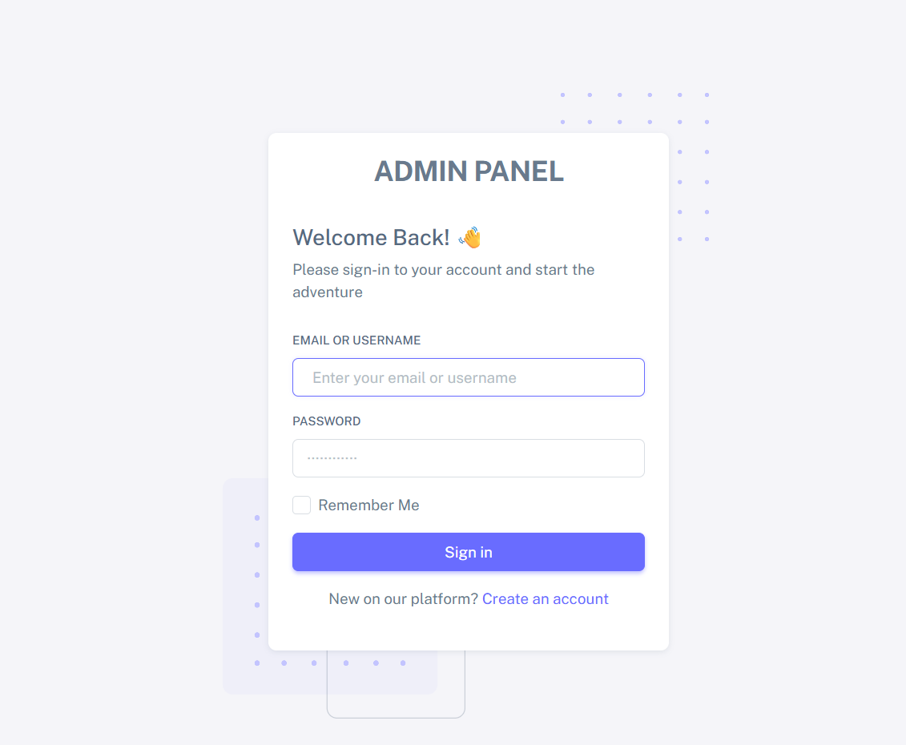
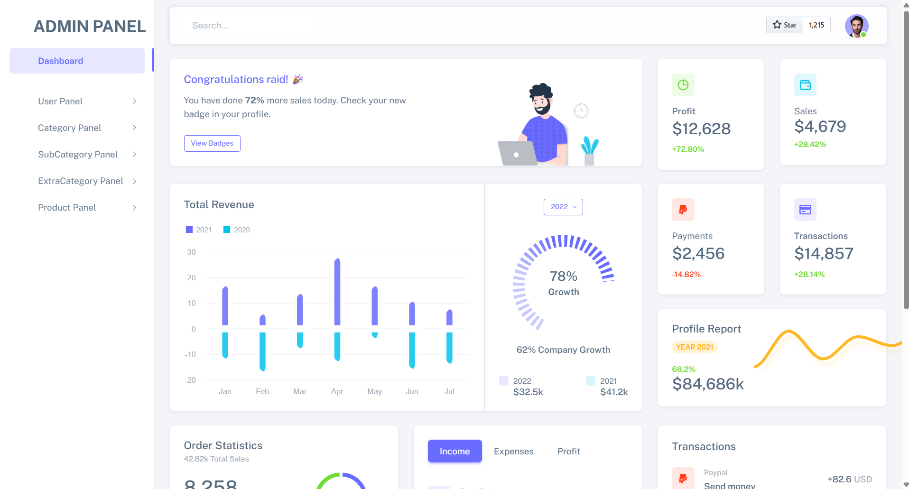
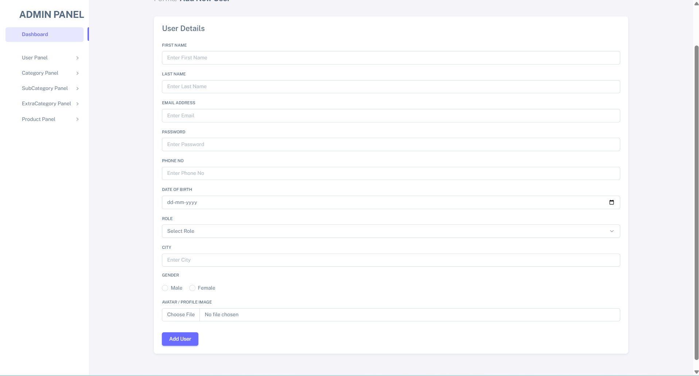
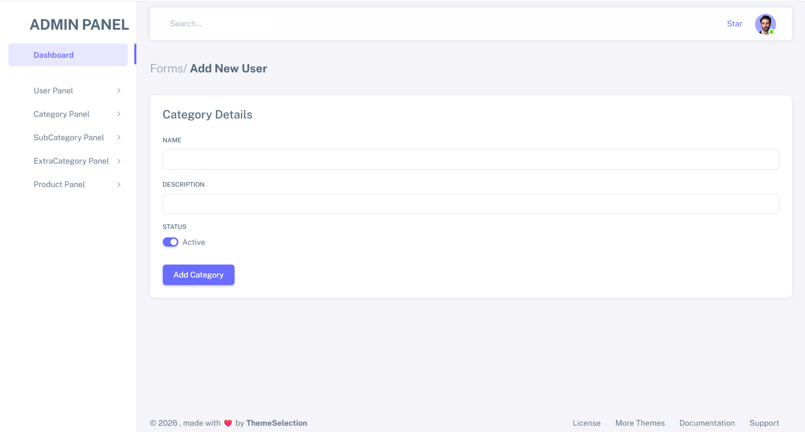
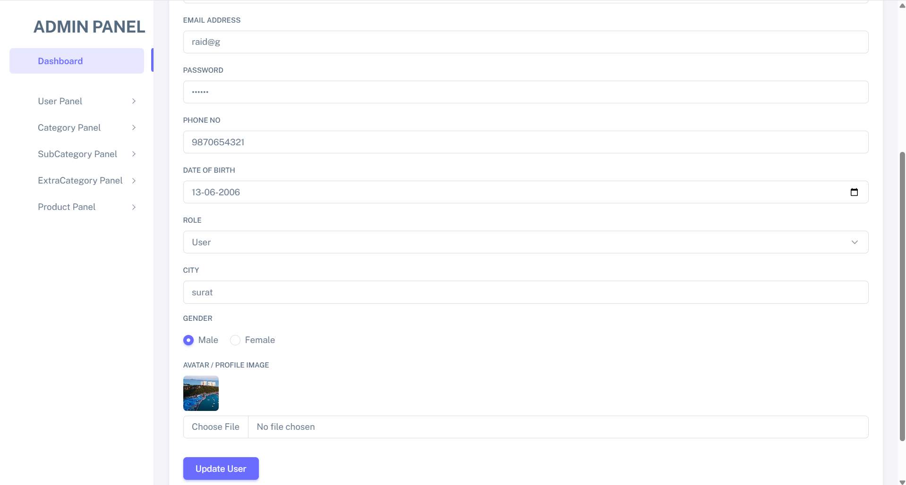

# 🚀 Admin Panel Dashboard

A modern and fully functional Admin Panel built using Node.js, Express.js, MongoDB, EJS, and Multer.

This project includes authentication, user management, image upload functionality, route protection, and a clean dashboard interface.

---

# ✨ Features

* 🔐 Admin Authentication (Login/Register)
* 🍪 Cookie-Based Authentication
* 👤 Add New Users
* 📝 Edit Existing Users
* ❌ Delete Users
* 🖼️ Avatar Upload using Multer
* 🔒 Password Hashing using bcryptjs
* 🛡️ Protected Routes with Middleware
* 📦 MongoDB Database Integration
* 🎨 Dynamic EJS Templates
* 📱 Responsive Ad

---

# 🛠️ Technologies Used

| Technology    | Purpose              |
| ------------- | -------------------- |
| Node.js       | Backend Runtime      |
| Express.js    | Server Framework     |
| MongoDB       | Database             |
| Mongoose      | MongoDB ODM          |
| EJS           | Templating Engine    |
| Multer        | File Upload Handling |
| bcryptjs      | Password Encryption  |
| cookie-parser | Cookie Management    |

---

# 📂 Project Structure

```bash
├── config
│   └── db.js
│
├── controllers
│   └── admin-controller.js
│
├── middleware
│   └── auth.js
│
├── models
│   └── admin-model.js
│
├── public
│   ├── uploads
│   └── assets
│
├── routes
│   └── admin-routes.js
│
├── views
│   ├── home.ejs
│   ├── login.ejs
│   ├── register.ejs
│   ├── addUser.ejs
│   ├── editUser.ejs
│   ├── viewUser.ejs
│   └── header.ejs
│
├── app.js
├── package.json
└── README.md
```

---

## 📸 Dashboard Previews

### 📊 Dashboard Overview


### 🔐 Admin Login


### 👥 User Management Table


### ➕ Add New User


### 👤 User Profile Details
